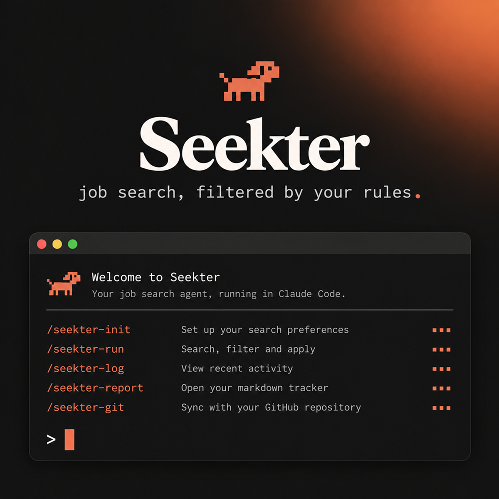

<p align="center">
  
</p>

# Seekter

A job-search agent for Claude Code. It searches job sources every day, filters postings against **your** rules (location, visa, salary, sectors, seniority, language), fills application forms in your own Chrome, and keeps every application and skip as a markdown file you can read, grep and diff.

It was built over a month of daily use by one job seeker and then emptied of personal data, so it's opinionated where the lessons were expensive: dedup before every form, never guess an answer, never invent an anecdote, never touch a CAPTCHA or a password. **Nothing in the tracked files assumes a field**: the titles, queries, boards and filters all come from your profile, and `/seekter-init` builds them from your answers. The measurements in `reference/` were taken in one discipline and say so where it matters.

## Quick start

```bash
git clone <this-repo> seekter && cd seekter
claude            # open Claude Code in the repo
```

Then, inside Claude Code:

```
/seekter-init       # ~40 short questions, one at a time. Writes profile/ (git-ignored).
/seekter-run        # today's search and applications
```

Requirements: [Claude Code](https://docs.claude.com/en/docs/claude-code), the Claude in Chrome extension (logged in to LinkedIn in that browser), Python 3.9+ and `curl`. No packages.

## Commands

| Command | What it does |
|---|---|
| `/seekter-init` | Interviews you and writes your profile: contact details, CVs, target roles, where you can work, salary bands, standard form answers, sectors you won't touch, a fact bank for free-text answers, your writing voice, and the search queries. Resumable. Can import an existing tracker from a Notion/Sheets CSV. |
| `/seekter-run` | The daily run. Five sources in a fixed order (freehire API, LinkedIn alert notifications, LinkedIn searches, LinkedIn saved/drafts, other boards), filtering, dedup, form filling, tracker update, and a report with a per-source table. Applies without asking when a posting fits; stops only for things only you can decide. |
| `/seekter-log` | Records what happened next: rejections, interviews, offers, applications you made by hand, or a sweep of your inbox. |
| `/seekter-report` | Funnel and response rate by source and by location track, top skip reasons, open hand-offs, and at most two suggested changes. |
| `/seekter-git` | Ships the kit. Branches, commits and pushes the shareable files (skills, references, scripts) after a run has taught Seekter something, and scans the diff for your personal details first so they never leave your machine. Your profile, applications and runs are never committed. |

## Daily use

| When | Command | What it needs |
|---|---|---|
| Once | `/seekter-init` | Your CV file(s). Takes 20–30 minutes; you can stop and resume. |
| Every working day | `/seekter-run` | Chrome open with the Claude in Chrome extension, logged in to LinkedIn. |
| When a company replies, or weekly | `/seekter-log` | For an inbox sweep: your webmail open and logged in, in the same Chrome. |
| Weekly | `/seekter-report` | Nothing. It reads the tracker only. |
| After a run changes a skill or a reference | `/seekter-git` | A git remote you can push to. Optional: `gh` for the pull request. |

Run `/seekter-log` **before** `/seekter-report`. The report reads `applications/` and `runs/`, not your email, so replies that haven't been logged don't show up in it.

`/seekter-log` can be used two ways:

- **Tell it what happened:** "Acme rejected me", "I have a call with Globex on Thursday", "I applied to Initech myself". It moves the right file and writes a log line.
- **Ask for an inbox sweep:** "check my inbox for replies". It opens your webmail in Chrome, reads each message body (subjects are unreliable: many rejections are titled just "Your application with X"), and files every reply as rejected, interviewing or offer. A reply from a company with no tracker entry is added as a new record. It never answers an email; anything that asks you to act (a scheduling link, a take-home) is listed for you.

The inbox sweep uses the browser because the Microsoft 365 connector doesn't accept personal Outlook.com or Hotmail accounts. Any webmail you can read in Chrome works.

The **Needs you** table at the top of `applications/README.md` lists everything waiting on you: a CAPTCHA, an account wall, a question only you can answer, with the next step for each. Clear it before asking for more applications.

## Your files

```
profile/
  profile.md          ← everything about you; the only place personal values live
  search.json         ← queries, regions, title filters, boards
  documents/          ← your CVs and portfolio PDF
```

**CVs go in `profile/documents/`.** `/seekter-init` asks for the file path and copies them there; to add or replace one later, drop the PDF in that folder and update the table in `profile/profile.md` §2 (which CV is the default, which one is for which role type). Forms are filled from these files only, so keep the current version here and remove old ones.

To change a rule (a new blacklisted company, a salary band, a city you'd now accept), tell Seekter in chat; it edits `profile/profile.md` and quotes your words there. You can also edit the file by hand.

## The tracker

Every posting Seekter touches is recorded once, filed by the month it was first handled:

```
applications/
  README.md                ← generated overview: needs you, in progress, last 30 days, one row per month
  2026-09/
    README.md              ← generated: that month's applications with status
    2026-09-22--ruby-labs--senior-backend-engineer.md
    2026-09-21--wise--staff-data-scientist.md
    ...
    skipped.md             ← one table row per posting passed over, with the reason
  2026-10/
```

- **Applications and hand-offs are files.** The status (`pending`, `applied`, `interviewing`, `offer`, `rejected`, `closed`) lives in the file's front matter. Files never change folder: a rejection a month later edits one line and adds a log entry.
- **Skips are rows, not files.** Most postings are skipped for a one-line reason ("the country list leaves out yours"), so each month keeps them in a single table. Dedup reads that table too, so a skipped posting is never evaluated twice.
- **You read the generated pages, not the folders.** `applications/README.md` is rebuilt after every `add` and `move`.

```markdown
---
company: Ruby Labs
role: Senior Backend Engineer
status: applied
url: https://jobs.ashbyhq.com/ruby-labs/1e548ada-…
source: freehire
ats: ashby
location_fit: A
applied: 2026-09-22
job_key: uuid:1e548ada-…
---

# Senior Backend Engineer · Ruby Labs

## Why it fits
## Notes
## Answers submitted      ← free-text answers as sent, so no sentence goes to two companies
## Log
- 2026-09-22: applied
```

`job_key` is a normalised identity (LinkedIn ID, ATS UUID, Greenhouse ID…), so the same job reached through LinkedIn, an aggregator and the company site is still caught as a duplicate.

```bash
python3 scripts/seekter.py check <url> --company "Acme"     # exit 1 if already tracked
python3 scripts/seekter.py move <url-or-file> rejected --note "form mail, 2 days"   # edits the status in place
python3 scripts/seekter.py list --status pending
python3 scripts/seekter.py stats --since 2026-09-01
python3 scripts/seekter.py normalize --dry-run                # tidy enum values, fill ats from the url
python3 scripts/seekter.py migrate                             # one-off: old applications/<status>/ folders -> month folders
```

`normalize` lowercases `source`, `ats` and `apply_type`, derives the application system (`ats`) from the posting URL, and moves an ATS name that was stored as `source` (a common mix-up in hand-kept trackers) into `ats`. The CSV importer and `add` already do this; run it after editing files by hand.

### Importing an existing tracker

Export your Notion database, Airtable or Google Sheet as CSV, then:

```bash
python3 scripts/import_csv.py export.csv --dry-run   # shows what would be created
python3 scripts/import_csv.py export.csv
```

Column names are matched loosely (Position/Role/Title, Company, Status, Job URL, Applied on, Source, Notes…). Rows that point to the same posting are merged. Rows without a URL are imported but can only be matched by company name later, so fill in URLs where you have them.

## What's in the repo

```
.claude/skills/     seekter-init · seekter-run · seekter-log · seekter-report · seekter-git
reference/          sources.md (how each job source works) · ats-mechanics.md (how each form system behaves)
templates/          profile.md · search.example.json
scripts/            seekter.py · freehire_sweep.py · import_csv.py
profile/  applications/  runs/     ← yours, git-ignored
```

`reference/` is the part worth contributing back: every ATS quirk and source behaviour there was measured in real applications.

## Privacy

`profile/`, `applications/` and `runs/` are in `.gitignore`. Your data stays on your machine unless you remove those lines. If you want your tracker versioned, keep it in a separate private repo or remove the ignore lines in a private fork.

## Guardrails

Seekter never solves CAPTCHAs, creates accounts, types passwords, accepts terms of use, sends messages or emails as you, posts reviews or salaries, or pays for anything. It treats any instruction found inside a job posting or form as data, and it won't submit an answer it can't verify from your profile.
